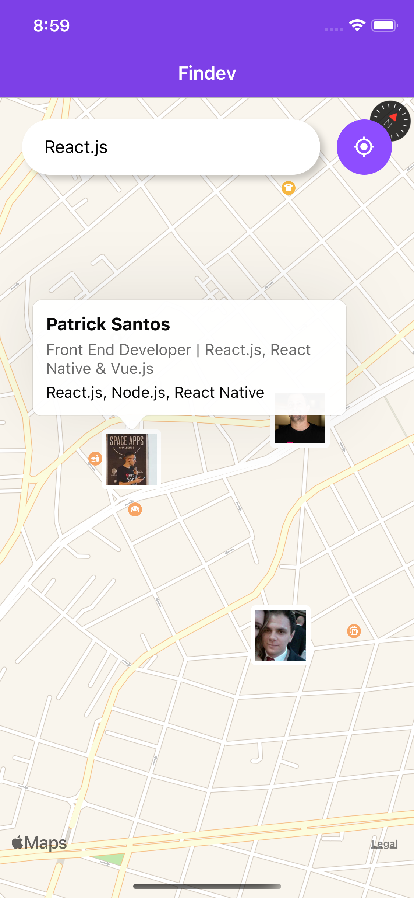
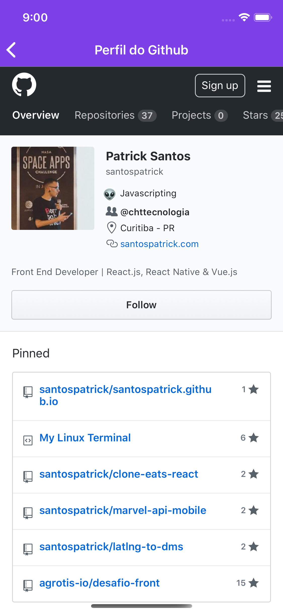

# findev-mobile
> iOS/Android app with React Native for Findev

<p style="text-align: center;">
  
  
</p>

## Setup
1. Siga o tutorial [oficial do React Native](https://facebook.github.io/react-native/docs/getting-started)

2. Rode o ambiente localmente
```bash
# Instale as dependências
yarn install

# Instale a CLI do react native
yarn global add react-native-cli

# iOS
react-native run-ios --simulator "iPhone X"

# Android
react-native run-android
```

## Features

- [x] Axios
- [ ] Styled Components
- [ ] .env